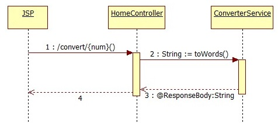
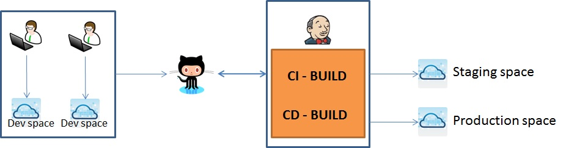
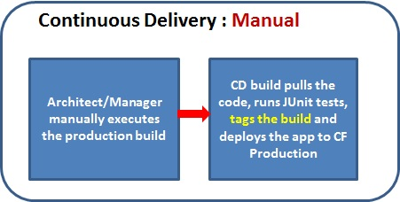

AmountCalculator
================

Converts given number to words. Example: Convert 2523.04 to "Two thousand five hundred twenty three and 04/100 dollars

Application URL: [http://amountconverter.cfapps.io/](http://amountconverter.cfapps.io/) 

The application is currently using Spring MVC framework. 
Below is control flow of the application.

#### Sequence Diagram

---

#### Continuous Integration and Continuous delivery architecture

###### Continuous Integration

###### Continuous Delivery

---

**Note**: Currently there is limit of amount denomination up till a billion. 
